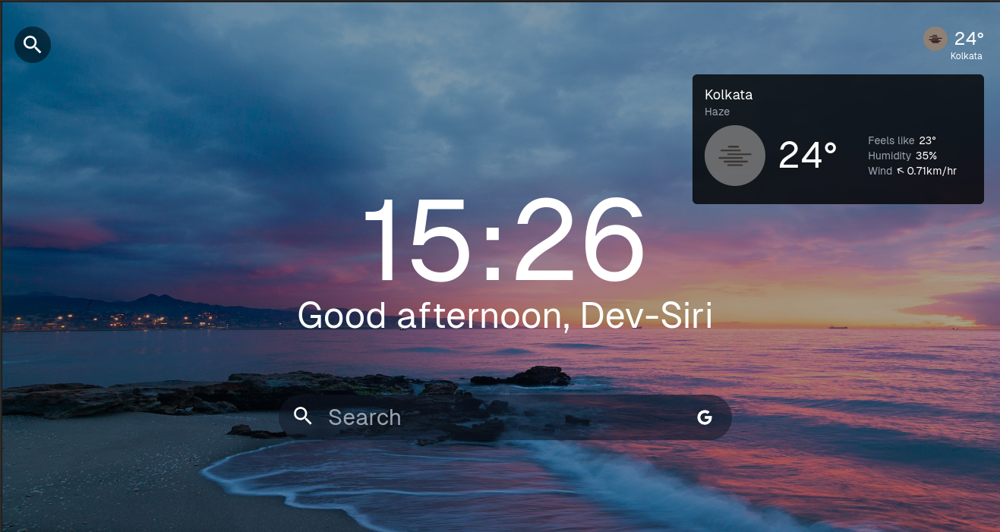

# Dev-Siri-s-NewTab

A momentum replacement for a ~28kb JS experience instead of the 1.7MB of momentum.



## Getting Started

- Clone

```sh
$ gcl https://github.com/Dev-Siri/Siri-s-NewTab
```

- Install dependencies

```sh
$ pnpm i

# or

$ bun i
```

- Build

```sh
$ pnpm build

# or

$ bun run build
```

- Also, make sure you have an API_KEY from open weather map api. Then you have to create a .env file and paste the api key as value there with this key. Furthermore, you'll also need an Unsplash access key (required for daily background images):

```s
VITE_OWA_API_KEY=""
VITE_UNSPLASH_ACCESS_KEY=""
```

- Then go to `chrome://extensions` in the browser
- Turn on developer mode (if not already on)
- Then click on "Load Unpacked" and select the dist folder that was created after the build

You now have a new tab that looks slightly less awful.

## License

This project is MIT Licensed, see [LICENSE](LICENSE)
